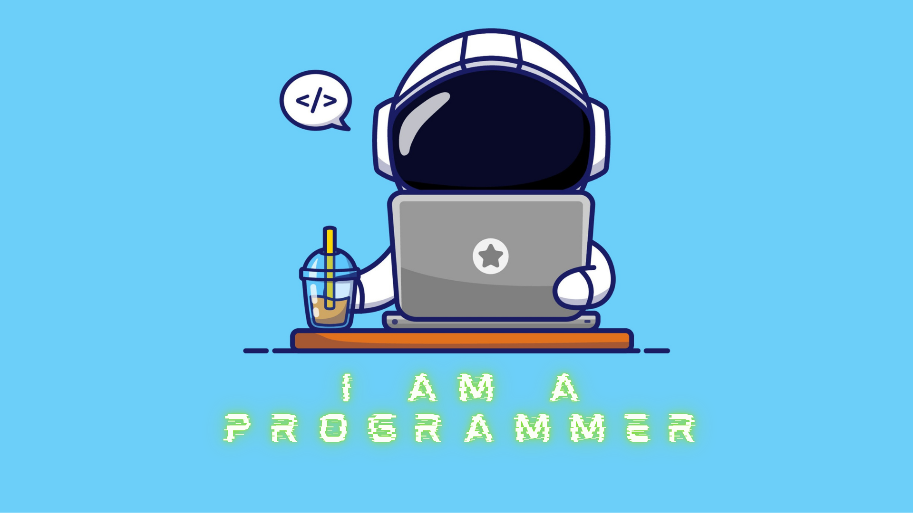

 
# 👨‍💻 Patrick Paul

 

  

### 🌟 Vision Statement

> *"Tech seems to be moving fast, thus learning and finding ways to leverage the power it offers us for the benefit of @everyone."*
 

### 🎯 About Me

Well, I like to code good code. I am a developer with very different ideas of how things work, or at least how they should work. Very different you can say that I am the bug in your code. A bug you will never find. But as stubborn as that sounds...   My journey in tech is fueled by some fundamental aspects:

- 🎓 The idea of what knowledge can help you do
- 💡 Creativity and problem-solving ideas
- 🧠 The mission I have in my stormy head
- 🚀 A tech company won't hurt

 

### 🛠️ Technology Stack

  
#### Core Languages

#### Frontend Development

#### Backend & Database

#### AI & Machine Learning

#### Tools & Platforms

  
### 🤝 Collaboration Interests

- 🌍 Tech Solutions that matter
- 🚀 Open Source Projects
- 💡 Innovation in Web Development
- 🤖 AI/ML Projects

### 📫 Let's Connect

- 🐦 Twitter: [@patric_forreal](https://x.com/patric_forreal)
- 📧 Email: patrickpaul367@gmail.com
- 💼 GitHub: [patrick-paul](https://github.com/patrick-paul)

---

 

### 📊 GitHub Journey
  

 
 

 
 

 

---

  
> *"Code is like humor. When you have to explain it, it's bad."* – Cory House

